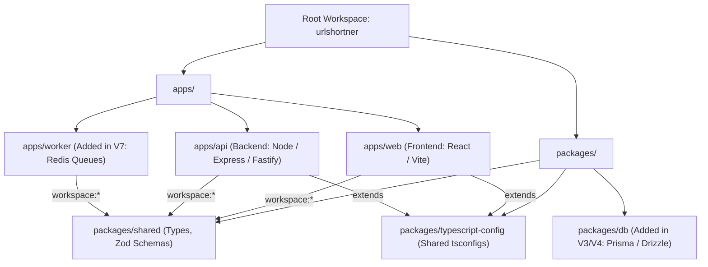

# Turborepo & Monorepo Architecture Guide

A practical, step-by-step handbook tailored for building your URL shortener project from **V1 (idea)** to **V8 (production scale)**.

---

## 1. What is a Monorepo & Turborepo?

### The Core Concept
- **Standard Repo (Polyrepo):** Separate Git repositories for frontend, backend, and worker.
  - *Drawback:* Duplicating types/schemas, having to manage separate PRs, and painful local orchestration.
- **Monorepo:** A single Git repository containing multiple independent applications and shared packages.
- **Turborepo:** A high-performance build orchestration system for JavaScript/TypeScript monorepos. It coordinates running tasks (`dev`, `build`, `test`, `lint`) across all apps/packages with intelligent dependency caching.



---

## 2. Directory Structure Breakdown

Here is the exact structure your repository will have:

```text
urlshortner/
├── .gitignore
├── package.json              # Monorepo root configuration & scripts
├── pnpm-workspace.yaml       # Declares which directories are workspace packages
├── turbo.json                # Turborepo task pipeline & caching rules
├── goal.md                   # Your project roadmap (V1 -> V8)
├── TURBOREPO_GUIDE.md        # This guide
│
├── apps/
│   ├── api/                  # Backend REST API
│   │   ├── src/
│   │   │   ├── index.ts      # Server entrypoint
│   │   │   ├── routes/       # URL creation, redirection routes
│   │   │   ├── services/     # Business logic & DB interaction
│   │   │   └── config/       # Environment variables
│   │   ├── package.json      # name: "@urlshortner/api"
│   │   └── tsconfig.json
│   │
│   ├── web/                  # Frontend UI
│   │   ├── src/
│   │   │   ├── App.tsx
│   │   │   └── main.tsx
│   │   ├── package.json      # name: "@urlshortner/web"
│   │   ├── vite.config.ts
│   │   └── tsconfig.json
│   │
│   └── worker/               # (V7) Asynchronous queue worker for analytics
│       ├── package.json      # name: "@urlshortner/worker"
│       └── src/
│
└── packages/
    ├── shared/               # Shared logic between API, Web, and Worker
    │   ├── src/
    │   │   ├── types.ts      # Shared interfaces (e.g. UrlMapping, User)
    │   │   └── schemas.ts    # Zod validation schemas (e.g. createUrlSchema)
    │   ├── package.json      # name: "@urlshortner/shared"
    │   └── tsconfig.json
    │
    └── typescript-config/    # Reusable tsconfig templates
        ├── base.json
        ├── package.json
        └── react.json
```

---

## 3. How Turborepo Works: Key Files Explained

### File 1: `pnpm-workspace.yaml`
This tells `pnpm` where to look for independent packages and apps.
```yaml
packages:
  - "apps/*"
  - "packages/*"
```

### File 2: Root `package.json`
Manages workspace-wide scripts and devDependencies. Notice that you do **not** run backend or frontend dependencies here—only tooling like `turbo` and `typescript`.
```json
{
  "name": "urlshortner-monorepo",
  "private": true,
  "scripts": {
    "dev": "turbo dev",
    "build": "turbo build",
    "lint": "turbo lint",
    "test": "turbo test",
    "clean": "turbo clean"
  },
  "devDependencies": {
    "turbo": "^2.0.0",
    "typescript": "^5.4.0"
  },
  "packageManager": "pnpm@9.0.0"
}
```

### File 3: `turbo.json`
Defines the **pipeline graph**—which tasks depend on each other and what outputs can be cached.
```json
{
  "$schema": "https://turbo.build/schema.json",
  "tasks": {
    "build": {
      "dependsOn": ["^build"],
      "outputs": ["dist/**", ".next/**"]
    },
    "lint": {
      "dependsOn": ["^build"]
    },
    "dev": {
      "cache": false,
      "persistent": true
    },
    "test": {
      "outputs": ["coverage/**"]
    }
  }
}
```
> **What does `"dependsOn": ["^build"]` mean?**
> The `^` symbol means: *"Build all my workspace dependencies first."*
> For example: Before building `apps/web`, Turbo will automatically build `packages/shared` first!

### File 4: Shared Dependencies via `workspace:*`
When `apps/api` or `apps/web` needs shared code, you don't publish an npm package. You simply declare:

In `apps/api/package.json`:
```json
{
  "name": "@urlshortner/api",
  "dependencies": {
    "@urlshortner/shared": "workspace:*"
  }
}
```
Now in `apps/api/src/index.ts`, you can directly import:
```typescript
import { createUrlSchema } from "@urlshortner/shared";
```

---

## 4. Step-by-Step Setup Guide (When Ready)

When you are ready to set up the repository, here is the exact execution flow:

### Phase 1: Prerequisites
Make sure you have:
1. **Node.js** (v18 or v20+ recommended). Check with: `node -v`
2. **pnpm** installed globally: `npm install -g pnpm`

---

### Phase 2: Initialize Root Files
1. Create root `.gitignore`:
   - Ignore `node_modules`, `dist`, `.turbo`, `.env*`.
2. Create `pnpm-workspace.yaml`:
   ```yaml
   packages:
     - "apps/*"
     - "packages/*"
   ```
3. Initialize root `package.json` with Turborepo:
   ```bash
   pnpm add -Dw turbo typescript
   ```
4. Create `turbo.json` with basic pipeline definitions.

---

### Phase 3: Create `packages/shared`
1. Create folder: `packages/shared`
2. Create `packages/shared/package.json`:
   ```json
   {
     "name": "@urlshortner/shared",
     "version": "0.0.1",
     "main": "./src/index.ts",
     "types": "./src/index.ts",
     "scripts": {
       "build": "tsc"
     },
     "dependencies": {
       "zod": "^3.22.4"
     },
     "devDependencies": {
       "typescript": "^5.4.0"
     }
   }
   ```
3. Add models/schemas in `packages/shared/src/index.ts`:
   - URL shortening payload validation (`url`, `customSlug`).
   - Standard API response types (`ShortUrlResponse`, `ApiError`).

---

### Phase 4: Create `apps/api` (Backend)
1. Create folder: `apps/api`
2. Add `apps/api/package.json` with dependencies:
   - `express` (or `fastify`), `cors`, `dotenv`
   - `"@urlshortner/shared": "workspace:*"`
3. Write initial server entrypoint in `apps/api/src/index.ts`:
   - `POST /api/shorten` (Validates with Zod schema from `@urlshortner/shared`).
   - `GET /:code` (Redirects to original URL).

---

### Phase 5: Create `apps/web` (Frontend)
1. Create folder: `apps/web` using Vite:
   - React + TypeScript template.
2. Add `"@urlshortner/shared": "workspace:*"` to `apps/web/package.json`.
3. Create simple UI:
   - Input box for original URL.
   - Button to shorten.
   - Display short URL with "Copy to clipboard".

---

### Phase 6: Run & Verify
From the **root folder**, run:
```bash
pnpm install
pnpm dev
```
Turborepo starts both `apps/api` (e.g. port 4000) and `apps/web` (e.g. port 5173) simultaneously!

---

## 5. Daily Command Cheat Sheet

| Action | Command (run from root) | What it does |
| :--- | :--- | :--- |
| **Install everything** | `pnpm install` | Links all packages and installs dependencies. |
| **Start dev mode** | `pnpm dev` | Runs dev servers for all apps in parallel. |
| **Build all apps** | `pnpm build` | Builds `packages/shared`, then `api` and `web`. |
| **Add dependency to root** | `pnpm add -Dw <pkg>` | Adds dev tooling across entire monorepo. |
| **Add dependency to 1 app** | `pnpm --filter @urlshortner/api add express` | Installs `express` specifically into `apps/api`. |
| **Add shared pkg to app** | `pnpm --filter @urlshortner/web add @urlshortner/shared@workspace:*` | Connects shared package. |
| **Prune for Docker (V5)** | `pnpm turbo prune @urlshortner/api --docker` | Extracts isolated lockfile and files for Docker build. |

---

## 6. How this maps to your [goal.md](file:///Users/mohitkumar/Desktop/urlshortner/goal.md) Roadmap

- **V1 (Basic URL Shortener):** `apps/api` with in-memory or SQLite/Postgres DB + basic web UI.
- **V2 (React + TS Full-Stack):** Polished React frontend consuming the API with shared types.
- **V3 (Auth & Security):** Add auth middleware in `apps/api`, user session types in `packages/shared`.
- **V4 (Redis & Rate Limiting):** Add Redis client to `apps/api`.
- **V5 (Docker & Scale):** Use `turbo prune` to build separate, optimized Docker images for `apps/api` and `apps/web`.
- **V6 (CI/CD - GitHub Actions):** Turborepo caching ensures CI only tests and builds what changed.
- **V7 (Distributed System & Queues):** Add `apps/worker` directly into `apps/`—it instantly shares `packages/shared` and DB clients without creating new repositories.
- **V8 (Hardening & Observability):** Standardized logging package added under `packages/logger`.
